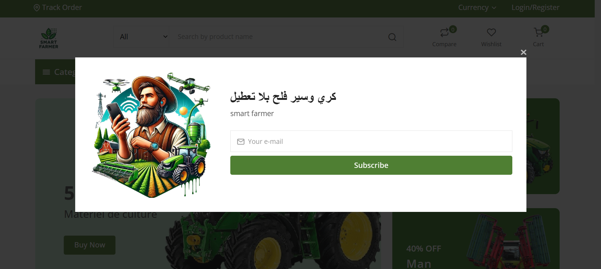
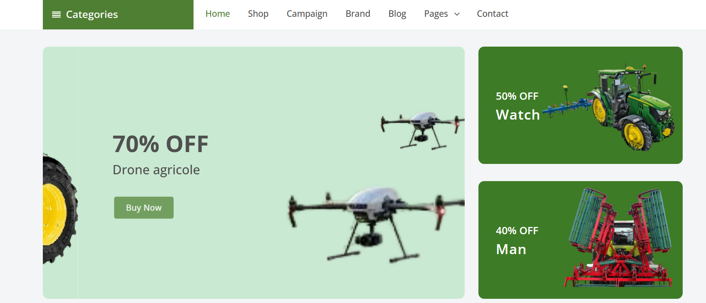
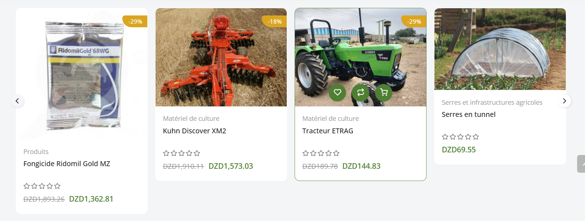
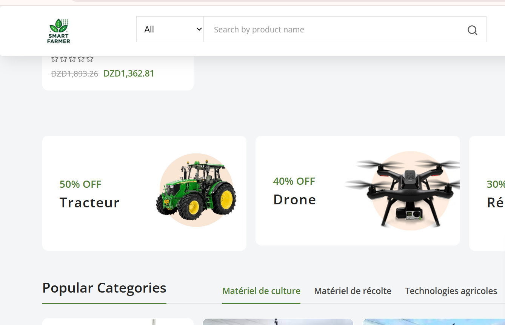
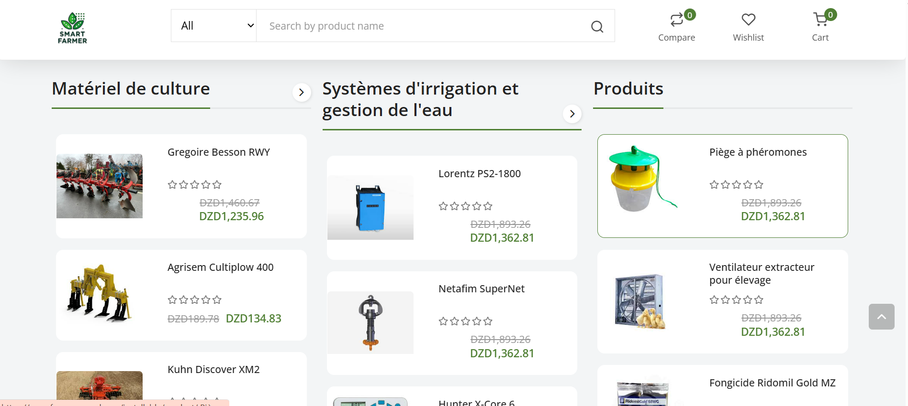
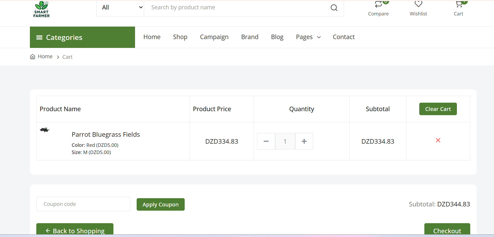

# 🛒 Smart Farmer Marketplace – Plateforme Agricole de Vente, Location et Services

La **Marketplace Smart Farmer** est une application mobile/web qui permet aux agriculteurs, producteurs et prestataires de **vendre, acheter ou louer** des produits, du matériel agricole et des services.  
Elle offre une interface simple, rapide et intelligente pour faciliter les **transactions agricoles locales et régionales**.

---

## Fonctionnalités principales :

### 📦 Vente et achat de matériel agricole
- Publiez des annonces de matériel : tracteurs, serres, systèmes d’irrigation, etc.
- Achetez directement auprès d’autres agriculteurs ou fournisseurs.

### 🧑‍🌾 Services agricoles
- Proposez ou réservez des services : labourage, transport, maintenance, etc.

### 📊 Estimation et tendances de marché
- Accédez aux **prix moyens**, tendances de demande, et **estimation automatique de prix** pour vos produits.

### 📍 Recherche intelligente
- Filtrage des offres par **région**, **type de matériel**, **prix** et **disponibilité**.
- Système de **recommandation intelligente** selon l’activité de l’utilisateur.

---

## Aperçu de l'application

### Accueil de la Marketplace

### Liste des produits agricoles disponibles

### Détail d’un produit avec bouton contact

### Publication d’une nouvelle annonce

### Liste des services agricoles disponibles

### le pagnier

---

## Objectif :
Permettre aux acteurs du secteur agricole de **se connecter directement**, d’**échanger du matériel** et de **trouver les services nécessaires**, tout en **évitant les intermédiaires coûteux**.

---

## Lien d’accès :
[Accéder à la Marketplace Smart Farmer](https://www.fennecpannel.com/installable/)

---

